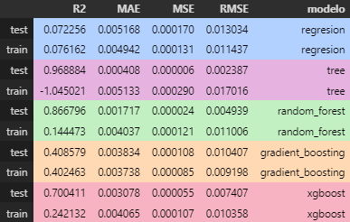
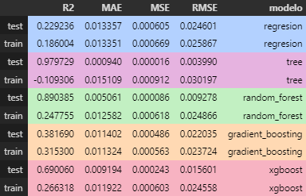

# 📊 Proyecto 9: Clustering y Modelos de Regresión

## 🔐 Descripción del Proyecto

Este proyecto se centra en el análisis de datos del comercio global, con el objetivo de mejorar la toma de decisiones en una empresa mediante técnicas de **clustering** y **regresión**. Asumirás el rol de un **científico de datos**, encargado de segmentar clientes y productos y construir modelos de predicción adaptados a cada segmento. Esto permitirá obtener *insights* específicos sobre los factores que influyen en las ventas y beneficios de la compañía.

El análisis no solo busca responder preguntas de negocio, sino también proporcionar recomendaciones accionables que optimicen los procesos y aumenten los beneficios.

## 🎯 Objetivos del proyecto

- **Segmentar clientes y productos** mediante algoritmos de clustering para identificar patrones significativos.
- **Desarrollar modelos de regresión** para cada segmento, explicando las relaciones entre las variables clave y permitiendo predecir métricas como ventas y beneficios.
- **Proporcionar recomendaciones accionables** basadas en los resultados, orientadas a maximizar la rentabilidad y optimizar las operaciones.

## 🗌 Estructura del Proyecto

El proyecto está organizado de la siguiente manera:

```bash
├── assets/               # Imágenes para mostrar en el README
│
├── datos/                # Conjuntos de datos sin procesar y ya procesados
│   ├── output/           # Datos procesados y resultados finales
│   └── raw/              # Datos en bruto (sin procesar)
│
├── modelos/              # Modelos predictivos
│
├── notebooks/            # Notebooks con el contenido y análisis de datos
│
├── src/                  # Scripts para la limpieza y procesamiento de datos
│
└── README.md             # Descripción general del proyecto e instrucciones
```

## 🔧 Instalación y Requisitos

Este proyecto utiliza [Python 3.12](https://docs.python.org/3.12/) y requiere las siguientes librerías:

- [pandas 2.2.3](https://pandas.pydata.org/docs/)
- [matplotlib 3.9.3](https://matplotlib.org/stable/index.html)
- [seaborn 0.13.2](https://seaborn.pydata.org/tutorial.html)
- [scikit-learn 1.5.2](https://scikit-learn.org/stable/)
- [numpy 2.0.0](https://numpy.org/doc/stable/)

Para instalar las dependencias, puedes ejecutar el siguiente comando dentro de un entorno virtual:

```bash
pip install -r requirements.txt
```

## 📊 Resultados y Conclusiones

### Métricas del modelo 1



- El modelo `random_forest` es el más equilibrado, con un **R² de 0.87 en train** y **0.86 en test**, junto a un error bajo en prueba (MAE de 0.0017). Esto lo convierte en una opción muy sólida y confiable para este cluster.
- Los modelos más complejos como `tree` y `gradient_boosting` presentan signos claros de **sobreajuste**. Aunque logran un **R² muy alto en train** (0.97 y 0.92 respectivamente), su rendimiento en prueba cae drásticamente (**R² de -0.90 y 0.40**) y tienen errores más altos, especialmente `tree`.



- Aunque el modelo `random_forest` sigue siendo el más robusto, su desempeño en prueba es menos consistente, con un **R² de 0.24** y un MAE de 0.0051. Aún así, su error es razonable en comparación con otros modelos.
- El modelo `tree` es el más problemático en este cluster, con un **R² negativo de -0.10** y un RMSE elevado (0.030 en prueba). Esto sugiere que no está manejando bien los datos nuevos y tiene serias dificultades para generalizar.

#### Comparativa de los 2 clusters:

- El Cluster 1 muestra un rendimiento más consistente y menor error global en las métricas de prueba, lo que podría indicar que sus datos son más fáciles de modelar o menos complejos que los del Cluster 2.
- En ambos clusters, `random_forest` se consolida como la mejor opción, ofreciendo un buen equilibrio entre entrenamiento y prueba. Por el contrario, `tree` y `gradient_boosting` necesitan ajustes importantes para reducir el sobreajuste.

- Para ambos clusters, el modelo `random_forest` es la opción más confiable gracias a su capacidad de mantener un rendimiento balanceado y errores bajos en prueba (por ejemplo, **MAE de 0.0017 en Cluster 1** y **0.0051 en Cluster 2**).
- Modelos más complejos como `tree` y `gradient_boosting` podrían beneficiarse de ajustes en parámetros como la profundidad máxima o los criterios de división para mejorar la generalización y evitar caídas drásticas en prueba.
- En general, el Cluster 1 parece ser más fácil de modelar, mientras que el Cluster 2 presenta desafíos adicionales que requieren mayor optimización en los modelos utilizados.

## 🔄 Próximos Pasos

- Implementar mejoras en la normalización de datos y optimización de hiperparámetros para los algoritmos de clustering.
- Probar modelos más avanzados, como regresión regularizada (Lasso o Ridge) y ensamblados (Gradient Boosting).
- Diseñar un dashboard interactivo que permita visualizar los resultados y ayudar en la toma de decisiones.

## 🤝 Contribuciones

Las contribuciones son bienvenidas. Si deseas colaborar en este proyecto, por favor abre un pull request o una issue en este repositorio.

